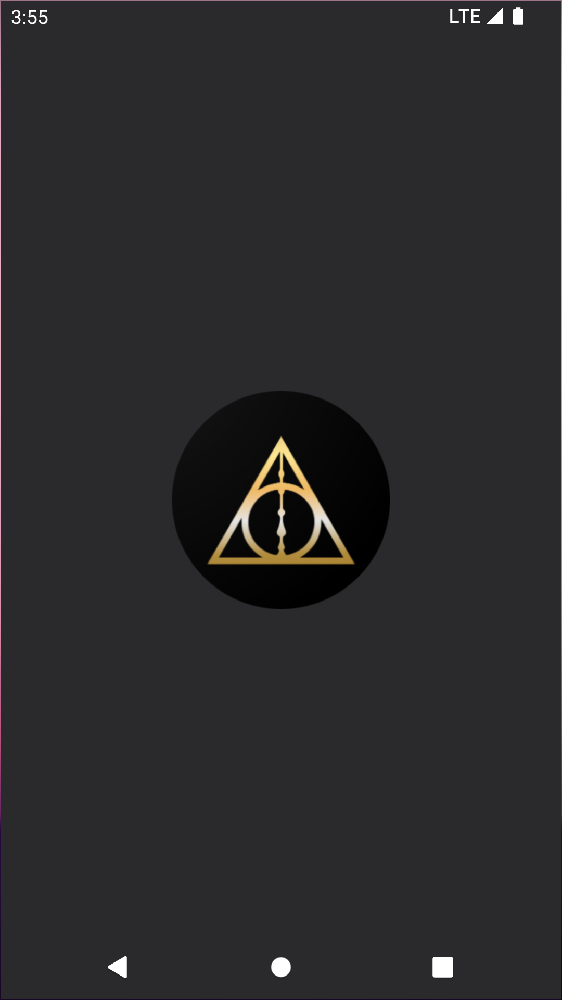
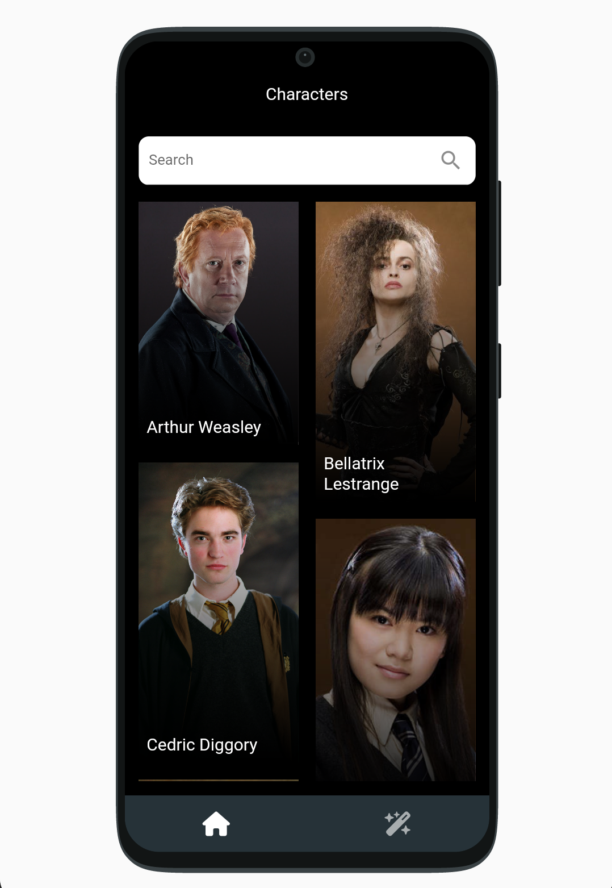
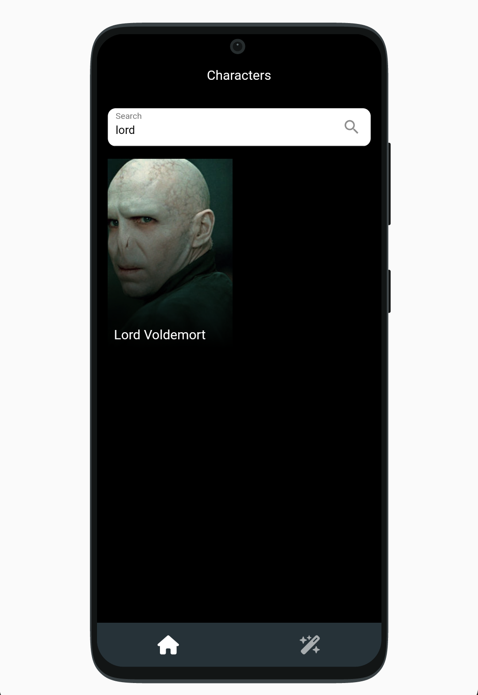
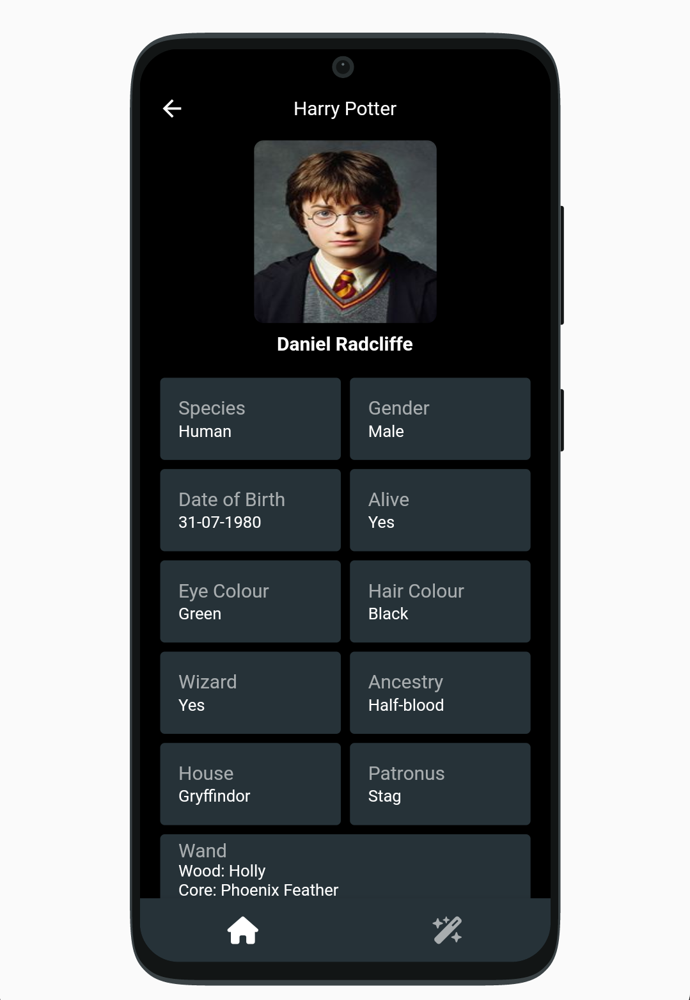
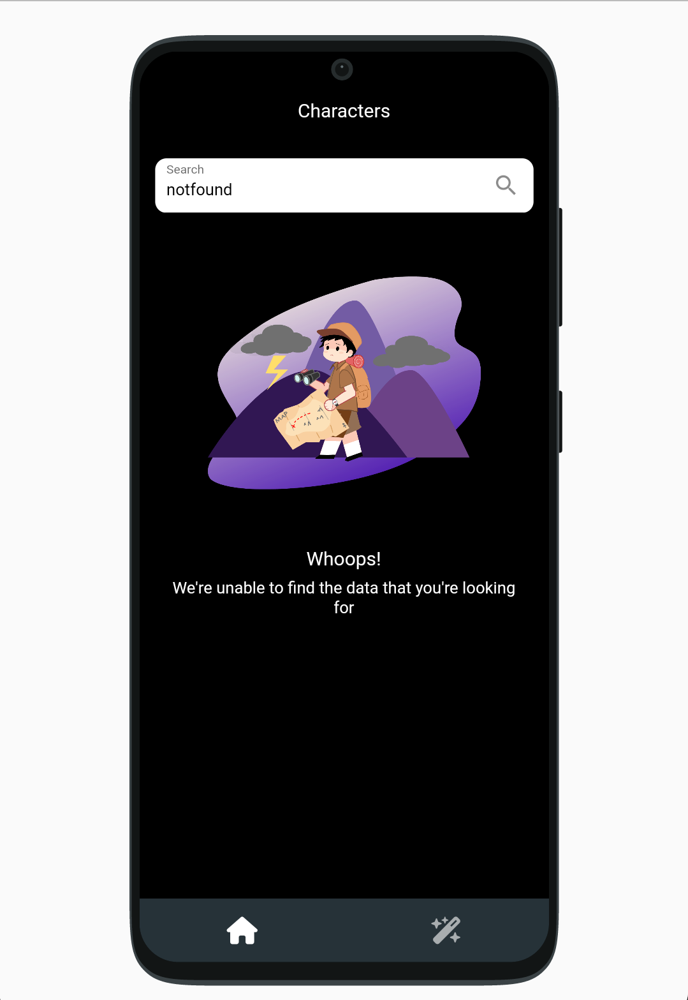
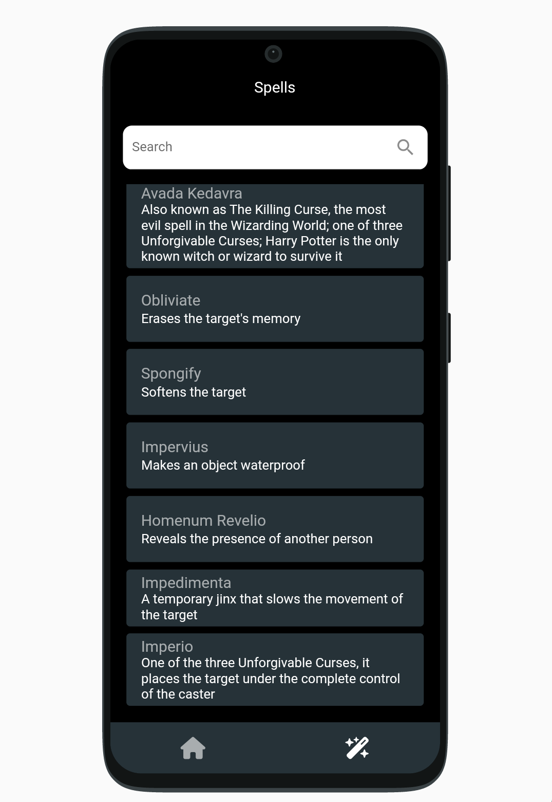

# HPotter Guide

Developed a mobile application using Flutter that providing comprehensive information about the characters, their traits, and spells from the beloved Harry Potter series. The API I used in the project is [HP-API](https://github.com/KostaSav/hp-api).

## Libraries and Tools

```yaml
dependencies:
  flutter:
    sdk: flutter

  cupertino_icons: ^1.0.2

  # State
  flutter_bloc: ^8.1.1
  
  # Equality
  equatable: ^2.0.5

  # Navigation
  go_router: ^6.0.0

  # Responsive
  sizer: ^2.0.15
  device_preview: ^1.1.0

  # UI
  font_awesome_flutter: ^10.3.0 
  animated_bottom_navigation_bar: ^1.1.0+1
  flutter_staggered_grid_view: ^0.6.2
  cached_network_image: ^3.2.3
  lottie: ^2.2.0

  # Network
  dio: ^4.0.6
  pretty_dio_logger: ^1.2.0-beta-1
  json_annotation: ^4.8.0

  # Dependency Injection
  get_it: ^7.2.0
  injectable: ^2.1.0

  # Local Database
  hive: ^2.2.3
  hive_flutter: ^1.1.0

  # Functional Programming
  freezed_annotation: ^2.2.0
  dartz: ^0.10.1
  kartal: ^2.8.0
  
  # Native Splash
  flutter_native_splash: any

dev_dependencies:
  flutter_test:
    sdk: flutter

  flutter_lints: ^2.0.0

  # Code Generation
  build_runner: ^2.3.3
  flutter_gen_runner:
  hive_generator: ^2.0.0
  json_serializable: ^6.6.0
  freezed: ^2.3.2
  injectable_generator: ^2.1.3

flutter_gen:
  output: lib/src/core/gen/
  integrations:
    lottie: true
  colors:
    inputs:
      - assets/color/color.xml
```

## Screenshots

<table>
  <tr>
     <td align="center">Native Splash</td>
     <td align="center">Characters</td>
     <td align="center">Search</td>
  </tr>
  <tr>
     <td></td>
     <td></td>
     <td></td>
  </tr>
</table>
<table>
  <tr>
     <td align="center">Character Details</td>
     <td align="center">Custom Error Widget</td>
     <td align="center">Spells</td>
  </tr>
  <tr>
     <td></td>
     <td></td>
     <td></td>
  </tr>
</table>

## Project Tree

```bash
...
├───lib
│   └───src
│       ├───core
│       │   ├───constants 
│       │   │   ├───enums
│       │   │   └───network
│       │   ├───di 
│       │   ├───error 
│       │   │   ├───exceptions
│       │   │   └───failures
│       │   ├───gen
│       │   ├───helpers
│       │   └───init
│       │       ├───network
│       │       ├───observer
│       │       ├───routes
│       │       └───theme
│       ├───features
│       │   ├───characters
│       │   │   ├───data
│       │   │   │   ├───datasources
│       │   │   │   └───repositories
│       │   │   ├───domain
│       │   │   │   ├───repositories
│       │   │   │   └───usecases
│       │   │   └───presentation
│       │   │       ├───blocs
│       │   │       │   └───characters
│       │   │       └───view
│       │   └───spells
│       │       ├───data
│       │       │   ├───datasources
│       │       │   └───repositories
│       │       ├───domain
│       │       │   ├───repositories
│       │       │   └───usecases
│       │       └───presentation
│       │           ├───blocs
│       │           │   └───spells
│       │           └───view
│       └───shared
│           ├───data
│           │   └───models
│           │       ├───character
│           │       ├───spells
│           │       └───wand
│           ├───domain
│           │   ├───entities
│           │   │   ├───character
│           │   │   ├───spells
│           │   │   └───wand
│           │   └───usecases
│           └───presentation
│               └───widgets
...
```
